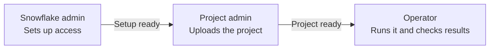

# Why deployment and operation use different roles

[Documentation](../index.md)

A platform team can set up a dbt project once without giving its day-to-day users account administration privileges. This repository separates three responsibilities and gives the project team two custom roles.

| Responsibility | Example role | What it controls |
| --- | --- | --- |
| Snowflake administrator | An approved platform administration role | Databases, schemas, role/user creation, identity assignment, source privileges, and external-access setup |
| dbt project administrator | `DBT_PROJECT_ADMIN` | Creation and ownership of the native project, reviewed source updates, project access grants, and migration |
| dbt operator | `DBT_OPERATOR` | Execution and monitoring of that project, warehouse usage, and model output in the approved schema |

These names are examples. The wrappers use the account, roles, users, and destinations in the selected configuration. Neither delegated role inherits the other.

## The handoff

Setup comes first, then the project upload, then execution. Each person signs in with their own user. The arrows show the order of the work:

## The object owner and runtime role differ

`deployment_role` selects the project administrator's calling role for deployment, migration, and `project-access`. `role` selects the operator's calling role and the role in the generated native profile. Separate connection names and optional expected users let the wrapper verify the actual identities as well as the roles.

The administrator grants the project role `CREATE DBT PROJECT` on the object schema. Creating the project gives that role `OWNERSHIP`. The operator receives `USAGE` to execute and `MONITOR` to inspect Snowsight, history, and recent artifacts. Parent database/schema access and runtime warehouse/data privileges are separate grants. [Snowflake dbt access control](https://docs.snowflake.com/en/user-guide/data-engineering/dbt-projects-on-snowflake-access-control).

Deployment normally has a compilation phase, and that phase uses the uploaded profile's role. Split-role configurations therefore require `auto_compile: false` and reject `deploy --build`. The project administrator delivers source; an operator performs the next compile or build. The deployment user does not need the operator role to complete deployment. [Deployment phases](https://docs.snowflake.com/en/user-guide/data-engineering/dbt-projects-on-snowflake-access-control).

For SQL and CLI executions, Snowflake also restricts the profile role's actions to privileges available to the calling user. A profile naming `DBT_OPERATOR` is insufficient if the deployment user has never been assigned that role. Each user must authenticate through its own connection for the intended responsibility.

The CLI is told `--secondary-roles NONE` on each invocation. This avoids silently combining privileges from other assigned roles. Primary-role inheritance and grants to `PUBLIC` still affect access; the platform administrator remains responsible for their role design. [CLI secondary-role option](https://docs.snowflake.com/en/release-notes/clients-drivers/snowflake-cli-2026) · [Access-control model](https://docs.snowflake.com/en/user-guide/security-access-control-overview).

## What least privilege means here

The bootstrap grants the operator schema-level `CREATE TABLE` and `CREATE VIEW` on the configured model schema. Source reads, additional materializations, custom model schemas, and deferral reads require explicit project-specific access. It grants no account-level object creation or management privilege to either delegated role.

Model schemas are precreated. If the chosen dbt runtime still issues a schema-creation statement requiring `CREATE SCHEMA`, the administrator can explicitly opt into that privilege on the configured model database. That allows creating additional schemas in that database, so use an isolated model database when accepting this scope. The grant is not added automatically in response to a failed run.

A project owner can replace source and settings, grant access in a regular schema, and drop its owned object. It also has Snowflake's ownership-level project capabilities. This split keeps the owner away from operator data privileges; it cannot turn Snowflake's object owner into a deployment-only privilege. Keep reviewed source and separate workflow identities as part of the handoff.

## Regular and managed-access schemas

The fresh-resource bootstrap creates regular schemas. Their project owner can grant the configured operator `USAGE` and `MONITOR` after creation. In a managed-access schema, only the schema owner or a role with `MANAGE GRANTS` controls object grants. Route that step to the Snowflake administrator rather than giving the project team account-wide grant management. [Grant authority](https://docs.snowflake.com/en/user-guide/security-access-control-privileges).

## Compatibility and adoption

A configuration without `deployment_role` retains the original single-role behavior. Its `role` is both owner/caller and runtime role, and it may use automatic compilation or `deploy --build`. An offline preview does not change existing objects, roles, users, or data.

To adopt separation, prepare independent custom roles and identities, add `deployment_role` and the selected connections/users, and disable automatic compilation. An existing project must already be owned by the intended project administrator; arrange any necessary ownership change as a separately reviewed administrator action. The wrapper never transfers ownership, recreates a project, or widens IAM automatically. See [administrator setup](../how-to/admin-setup.md) and [project administration](../how-to/project-admin.md).
