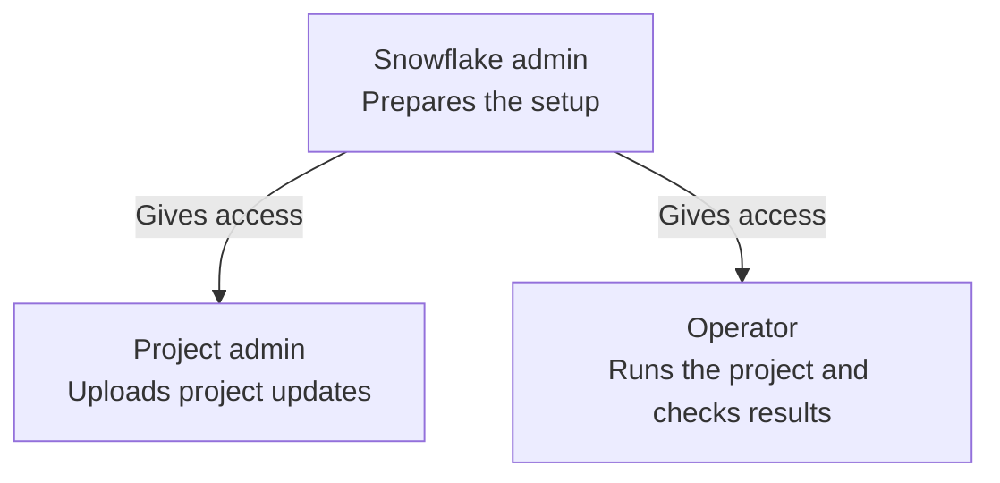

# Native dbt projects on Snowflake

Deploy reviewed dbt source and run models through separate Snowflake identities. Start with your responsibility, or follow the tutorials to learn the complete setup.

| Responsibility | Start here |
| --- | --- |
| Snowflake administrator: databases, schemas, roles, users, and grants | [Prepare databases, roles, and users](how-to/admin-setup.md) |
| dbt project administrator: source deployment, project ownership, and access | [Deploy and hand off access](how-to/project-admin.md) |
| dbt operator: builds, recovery, sources, and logs | [Run and retry](how-to/run-and-retry.md) · [Inspect runs](how-to/inspect-runs.md) |

The Snowflake admin gives the project team access for two separate jobs:

## Tutorials

Follow these lessons in order to preview a project, deploy it, and build a view.

1. [Preview the example](tutorials/preview-the-example.md) — inspect a model and create an offline deployment plan.
2. [Deploy your first project](tutorials/first-deployment.md) — set up fresh resources and use separate project administrator and operator logins.

## How-to guides

Use a guide to complete a specific task with your selected configuration.

| Task | Guide |
| --- | --- |
| Provision access and identities | [Administrator setup](how-to/admin-setup.md) |
| Deploy source and grant operator access | [Project administration](how-to/project-admin.md) |
| Deploy or run from GitHub | [Separate GitHub workflows and identities](how-to/github-actions.md) |
| Convert a numbered project to LIVE | [Migrate to LIVE](how-to/migrate-to-live.md) |
| Build models or recover a failed run | [Run and retry](how-to/run-and-retry.md) |
| Find execution history and logs | [Inspect runs](how-to/inspect-runs.md) |
| Build only changed models | [Baseline state](how-to/state-build.md) |
| Check source data age | [Source freshness](how-to/check-source-freshness.md) |
| Give an agent task-specific context | [Use the repository skills](how-to/use-agent-skills.md) |

## Reference

Look up exact settings, options, accepted values, and checks.

- [Configuration](reference/configuration.md)
- [Commands](reference/commands.md)

## Explanation

Understand the design and its tradeoffs.

- [Why deployment and operation use different roles](explanation/role-separation.md)
- [Why use Snowflake CLI and GitHub Actions?](explanation/deployment-choice.md)
- [Why LIVE changes deployment and recovery](explanation/live-version.md)
