# Deployment walkthrough screenshots

Captured on **3 October 2026**. Snowsight and GitHub images are unedited browser screenshots. Wizard images are browser captures of readable views generated from the actual recorded terminal output; the original transcripts are linked below.

Project: `DEV_DBT_PRJ.PROJECTS.NATIVE_DBT_EXAMPLE`. Owner: `DEV_DBT_PRJ_DEPLOYER`. Runtime: dbt Fusion `2.0.0-preview.210`.

These captures document the original single-role setup rather than the current administrator/project-admin/operator handoff. The new role setup uses separate identities and disables deployment compilation. These captures document the initial implementation and GitHub run at `b2dade2`, before the added compilation/writeback wizard prompts and expanded 68-test suite. Follow the [current tutorial](../tutorials/first-deployment.md) and [validation record](../validation.md) for the latest behavior.

## Wizard setup

The wizard infers the account, project, and profile, asks for the database (`dev_dbt_prj`), and saves the selected destinations. Role and schema defaults in this example were supplied as command arguments. Blank responses accept the value in brackets.

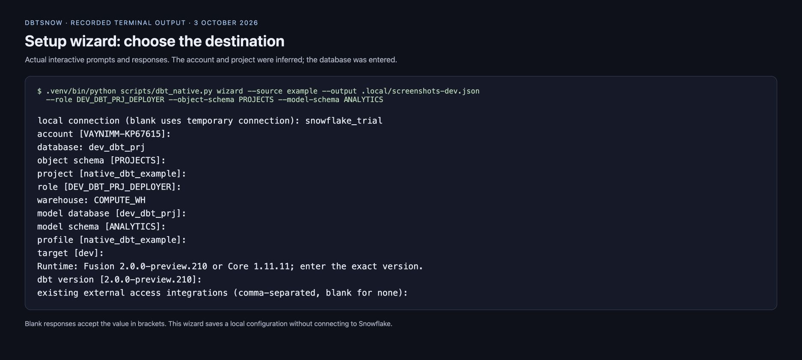

[Full recorded wizard transcript](wizard-transcript.txt).

## Deployment preview

The saved plan shows the native object, model destination, runtime, and exact upload list. This dry run does not connect to Snowflake.

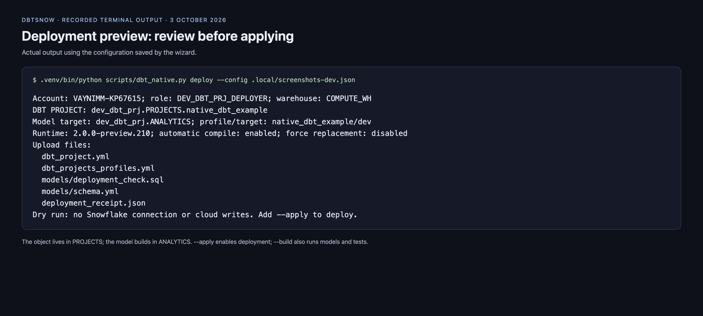

[Original preview output](deployment-preview.txt).

## Project list

The native dbt project appears under Transformation → dbt Projects.

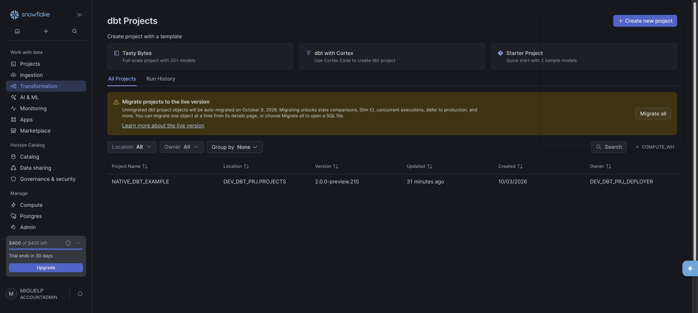

## Project details

Catalog shows the database, schema, owner, runtime, and default target `dev`. The displayed definition is Snowflake's generated DDL; the deployment template updates the existing object without `--force`.

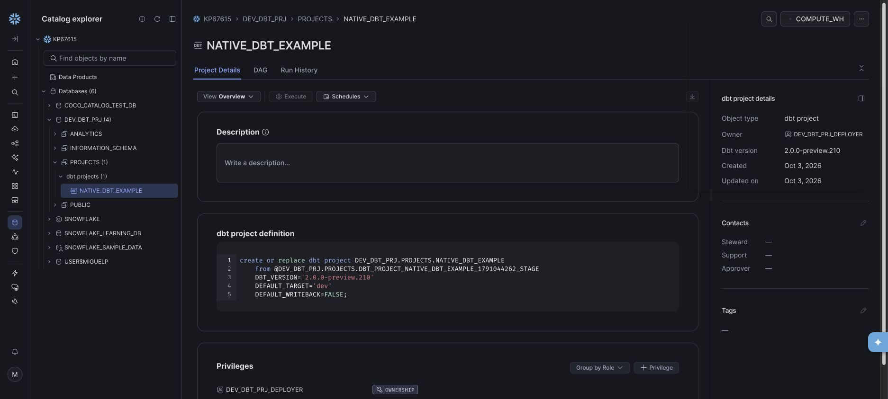

## Run history

Both `build --target dev` executions succeeded. These are explicit build executions; no scheduled task was created.

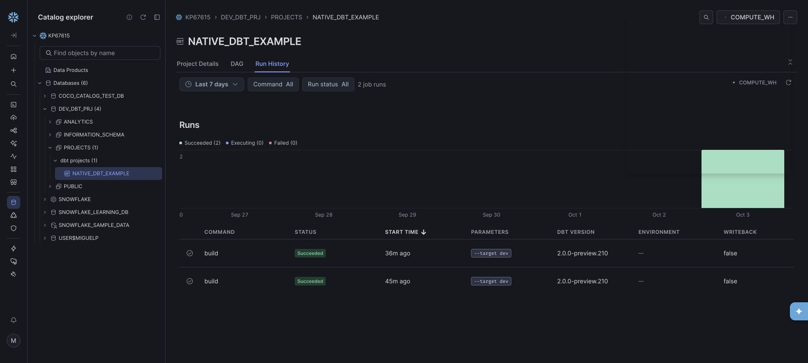

## Build details

The latest execution succeeded in 8.9 seconds on the X-Small `COMPUTE_WH` warehouse. Query ID: `01c77c6c-0000-7510-0000-484500034626`.

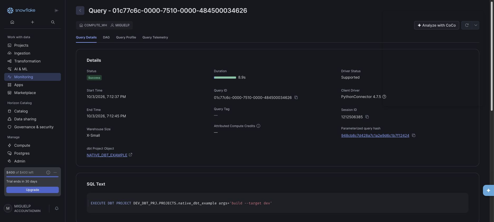

## Model result

The `deployment_check` view built successfully in 1.3 seconds.

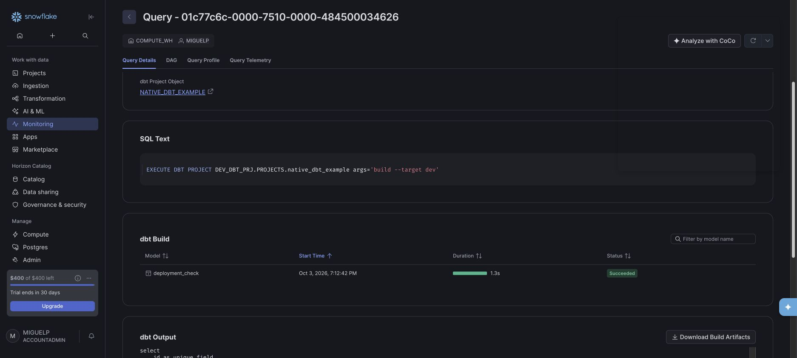

## Execution logs

The dbt output ends with **1 model, 2 tests, 3 total, 3 success**. It shows the unique test passing and the successful build summary.

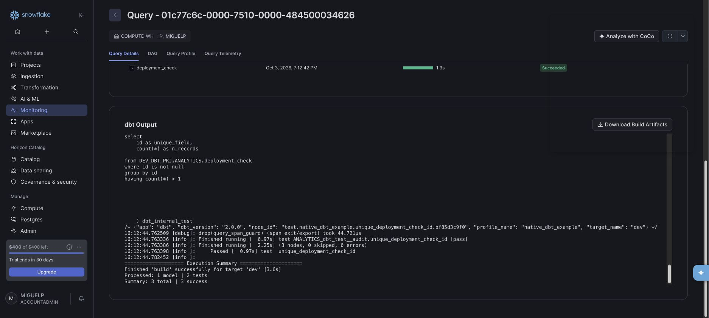

## GitHub Actions summary

The [Check template run](https://github.com/MiguelElGallo/dbtsnow/actions/runs/37136412860) passed for commit `b2dade2`. These GitHub screenshots show CI validation. The live Snowflake deployment and builds shown above were executed locally.

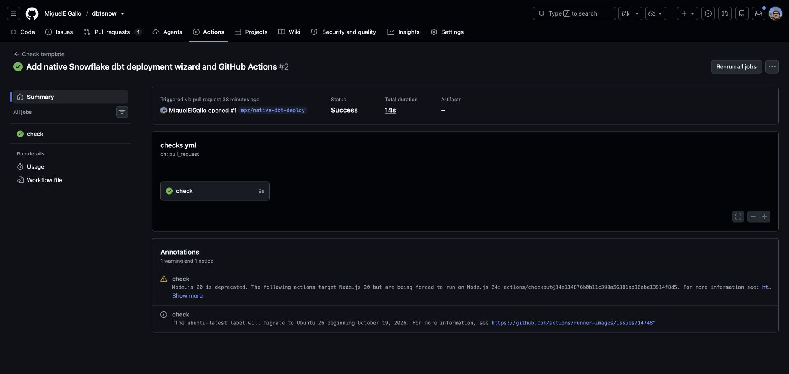

## GitHub quality-check logs

Runner logs confirm Ruff lint, formatting, and ty type checks passed.

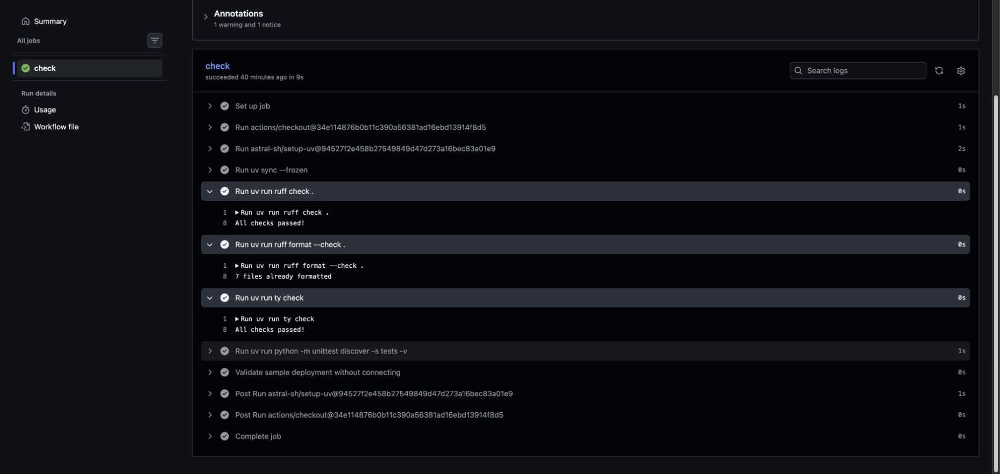

## GitHub tests and deployment preview

The [job logs](https://github.com/MiguelElGallo/dbtsnow/actions/runs/37136412860/job/111241745701) show **34 tests passed** and a successful offline deployment preview using the sample account placeholder. The preview performs no Snowflake deployment.

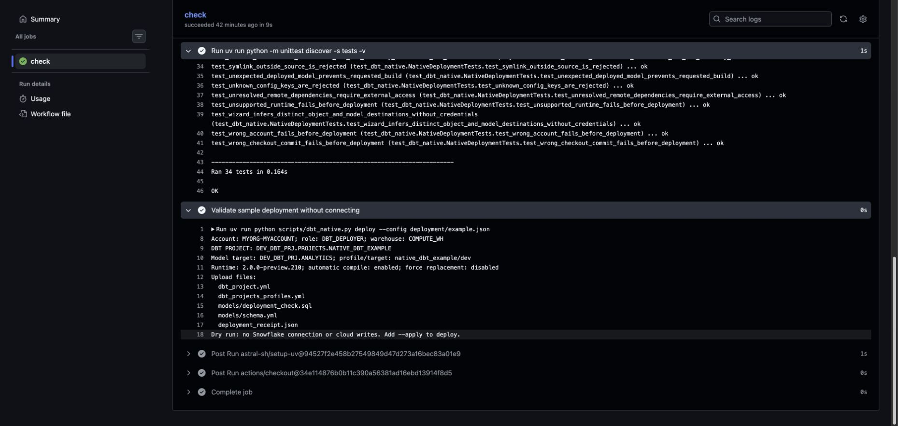

Return to the [documentation home](../index.md).
